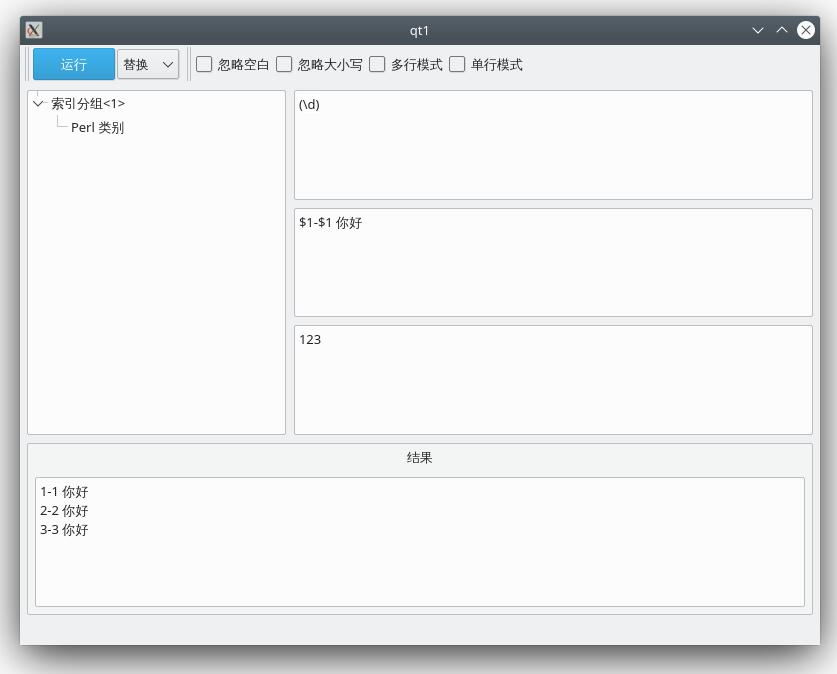
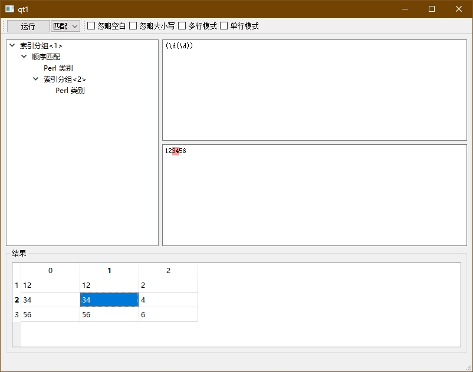

# Regex Tool

一个跨平台的正则表达式调试工具。

正则引擎来自 rust 官方库，界面使用 Qt，通过 cxx bridge 把 rust 库静态链接进主程序。

## 特性

* 实时解析正则语法树
* 支持 匹配、替换、分割 3 种模式
* 支持高亮语法树中选中的部分
* 支持高亮匹配项
* 跨平台，已测试 Windows 和 Arch Linux

## 下载

仅限 Windows x64 系统。

<https://github.com/wzv5/regex_tool/releases/latest>

或者使用 [Scoop](https://scoop.sh)：

```
scoop bucket add wzv5 https://github.com/wzv5/ScoopBucket
scoop install wzv5/regex-tool
```

其他系统请自行编译。

## 截图





## 编译

安装 rust，然后使用 cmake 编译。

Windows 编译示例：

```shell
git clone https://github.com/wzv5/regex_tool
cd regex_tool
mkdir build
cd build
cmake .. -G 'Visual Studio 17 2022' -DQt6_ROOT=D:\Qt\6.6.0\msvc2019_64
cmake --build . --config Release
```

## 已知问题

* rust 正则引擎不支持前向、后向匹配
